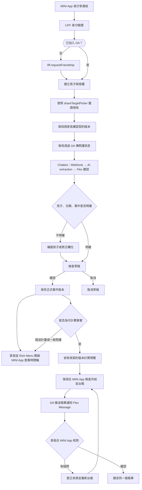
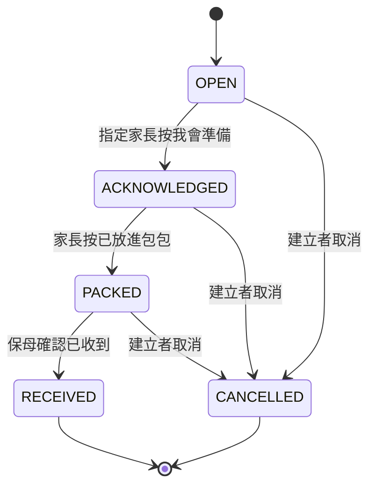

# CareLink User Journey

版本：1.2｜2026-09-16｜內部凍結 9/23｜官方截止 9/24 17:00｜設計提案

本文件描述家長與保母如何完成日常紀錄、交班與月結。所有範例均為合成情境；「湯圓」「粉圓」沿用使用者提供的暱稱作為費率案例，沒有加入真實兒童資料。金額與政策以 [PRD](01_PRD_v1.md) 為準。

## 1. 目前的工作與預期改變

依使用者觀察，保母的日誌、LINE、契約與提醒分散。尚未量測各步驟耗時，也尚未完成正式訪談。

| 時點 | 目前工作 | v1 的操作 | 預期改善，待驗證 |
|---|---|---|---|
| 初次合作 | 翻紙本確認約定 | 在 MINI App 輸入契約條件，家長與保母確認同一版本 | 可直接查到托育時間及費率 |
| 送托前 | 口頭或 LINE 交代接送與用品 | 傳給 OA，Chatbot 抽取後以 Flex 確認交班事項 | 區分未讀、已知悉與已完成 |
| 白天 | 傳 LINE，另填照護日誌 | 傳給 OA，Chatbot 抽取後以 Flex Message 確認 | 已確認內容直接成為 MINI App 時間軸資料 |
| 接回時 | 憑對話或記憶記錄時間 | 保母確認實際簽退 | 費用可以回查實際事件 |
| 月底 | 找契約、翻對話、手算 | 保母在 MINI App 核對後出帳，OA 通知家長，家長在 MINI App 逐項確認 | 每筆費用有數量、單價與來源 |
| 退托 | 逐一整理資料與權限 | 結束托育關係並撤銷照護權限 | 不再讓舊保母看見後續照護資料 |

OA 是新輸入入口，不能旁讀原本的私人對話。初次教學必須直接說明：「請把要記錄的內容傳到這個官方帳號。」使用者從 OA Rich Menu 點選對應功能開啟 MINI App。

## 2. 全程流程

## 3. J00：首次觸達與加入

前提：使用者透過朋友分享、搜尋或其他方式接觸 CareLink。

| 步驟 | 操作者與畫面 | 系統處理 | 成功條件 |
|---|---|---|---|
| 1 | 使用者點開分享的 CareLink 連結或從 Rich Menu 進入 | LINE 開啟 MINI App | 進入 CareLink MINI App 首頁 |
| 2 | MINI App 自動使用 LIFF SDK 取得 ID token | LIFF → ID token → Backend 驗證 → LINE sub → 對應或建立 CareLink User | 後端取得可信 LINE 身分 |
| 3 | 若使用者尚未加入 CareLink OA | liff.requestFriendship() 引導加入或解除封鎖 | 使用者加入 OA，可接收通知與使用 Rich Menu |

首次觸達後僅建立 CareLink User 與 OA 關係，不自動取得孩子資料權限。後續的孩子建立、邀請與契約設定見 J01。

## 4. J01：初次綁定與契約設定

前提：已有托育合作意向。v1 不負責媒合、保母資格審核或正式簽約。

| 步驟 | 操作者與畫面 | 系統處理 | 成功條件 |
|---|---|---|---|
| 1 | 家長在 MINI App 建立孩子暱稱 | 建立孩子及家長授權 | 不要求身分證、地址、完整生日 |
| 2 | 家長點「邀請保母」 | 檢查 liff.isApiAvailable('shareTargetPicker')；可用時開啟 shareTargetPicker；不可用時提供複製連結 fallback。產生 unique invite token，DB 只存 token hash | 邀請僅分享連結，不直接授權 |
| 3 | 保母點開邀請、登入 MINI App、接受 | LIFF 驗證 → 建立待核對關係 | 尚未取得孩子資料權限 |
| 4 | 家長在 MINI App 核對保母帳號後啟用 | 建立有效 CareRelationship 與保母 AccessGrant | 接受者與啟用者均有稽核紀錄 |
| 5 | 保母在 MINI App 填月托／臨托、期間、排程及費率 | 檢查必填條件，建立 ContractVersion 草稿 | 尚未生效，不能拿草稿自動計費 |
| 6 | 指定家長及保母檢視並確認 | 固定版本內容摘要與生效日期 | 兩人確認同一內容才成為可用版本 |

例：湯圓使用 FIXED、伙食 MONTHLY 1,500 元；粉圓使用 FIXED、PER_MEAL 100 元及每晚 1,500 元。月托費與實際托育時間需自行輸入，系統不由暱稱推測設定。

錯誤邀請、過期邀請或邀請已用過，顯示「這份邀請已失效，請家長重新建立」。修改契約時顯示「條件已變更，雙方需要重新確認」，不能沿用前一版同意。

## 5. J02：一句話新增照護紀錄（Chatbot：Conversation → Structured Care Data）

保母選定湯圓後，在 OA 傳：「今天 11:40 喝奶 150ml，13:10 睡著。」

Chatbot 不是 FAQ 機器人，而是「Conversation → Structured Care Data」的資料輸入介面：

1. Messaging API Webhook 接收訊息，AI extraction 抽取結構化資料，schema validation 驗證後產生草稿。
2. OA 以 Flex Message 回覆含日期、孩子與兩筆事件的草稿卡。入睡只記開始，不先猜睡了多久。
3. 保母按「確認全部」，或先按「修改」調整錯字、時間或奶量。修改後產生新的草稿版本。
4. 後端再次確認授權及草稿版本，在同一交易寫入事件、修訂紀錄與稽核。
5. 成功卡顯示「已儲存 2 筆」，家長從 OA Rich Menu 開啟 MINI App 時間軸可看見來源角色與確認時間。

| 類型 | 卡片示例 |
|---|---|
| 草稿 | 湯圓｜2026/09/18｜11:40 喝奶 150 ml；13:10 入睡｜確認全部／修改／取消 |
| 已確認 | 已儲存 2 筆照護紀錄｜查看今日紀錄 |
| 多孩子不明 | 這筆要記在哪個孩子名下？｜僅列此人可存取的孩子 |
| 日期不明 | 請確認發生日期與時間。訊息收到時間僅作參考 |
| AI 失敗 | 這次沒有整理成功，尚未新增紀錄。｜手動填寫／稍後重試 |

「等等喝 150」是計畫，「沒有喝奶」不能建立 150 ml 喝奶事件。「喝 150」缺少單位時要求確認，不能默認。若使用中的孩子選擇已過期，先重選。

家長可查看並提出更正；不能直接把保母確認的奶量覆寫。一次訊息抽出多筆時，v1 採確認整批有效草稿；任何一筆缺必要欄位，整批先修正。進階逐筆確認留待後續。

## 6. J03：接送計畫、實際簽退與逾時

此例的合成契約約定 18:00 結束。家長 15:00 傳：「今天阿嬤大概 19:00 接。」

| 時序 | 家長 | 保母 | 系統狀態 |
|---|---|---|---|
| 下午 | 確認 19:00、接送稱呼「阿嬤」 | 在交班列表看見安排，按已知悉 | PLANNED_PICKUP；顯示尚未完成接送，不計費 |
| 到場 | 配合現場確認接送者 | 依現有接送核對程序處理 | App 的稱呼不是接送身分驗證 |
| 18:31 | 可查閱紀錄 | 確認實際簽退 18:31 | CHECK_OUT 正式事件連到出勤 session |
| 計費預覽 | 看見逾時費與原因 | 檢查有無記錯 | 31 分鐘，ceil(31/30) × 98 = 196 元 |
| 爭議 | 若認為時間不對，提出更正 | 核實實際時間 | 待確認帳單停止鎖定 |

計畫變更不修改契約。若家長提出「下個月起每天 19:00 接」，保母應到契約頁建立新版本；v1 不必由 AI 自動完成契約變更。

## 7. J04：用品責任交接

保母傳：「湯圓明天要帶一包尿布。」確認草稿時指定有授權的家長為負責人。

P0 提供待辦列表與狀態流轉。家長按「已放進包包」不等於保母「已收到」，需要保母確認才完成。P1 才提供排程提醒；提醒失敗時，列表仍保留未完成事項，不能顯示送達成功。

## 8. J05：臨托、餐數與過夜

臨托孩子使用 TEMP 契約。保母確認 09:00 簽到、11:30 簽退及一餐，當天已確認為平日。

費用預覽為 2.5 × 196 + 100 = 590 元。若同樣時段落在已確認的週末，時薪改用 200。畫面顯示日期分類與費率，使用者不必自行判斷系統用了哪一種單價。

餐數由 MEAL 事件累計；喝奶事件不自動算一餐。MONTHLY 伙食契約即使記了餐數，也只收約定月額。不同訊息重複描述同一餐時，顯示疑似重複供保母核對，不擅自刪除。

過夜透過獨立表單確認夜間起迄、night_date 與夜數。僅跨午夜不建立過夜費。若該區間與時薪或月托延托重疊、契約又沒有選定加收／取代政策，顯示：「過夜與計時費的計算方式尚未約定，這份帳單暫時不能出帳。」

跨月出勤、非排程日月托、漏簽退等例外會列入待處理，不把不完整時數當成零費用。

## 9. J06：月底出帳、確認與更正

保母在 MINI App 開啟九月結算，先看阻擋事項，再看已計算項目。若還有未完成出勤或計費相關草稿，必須補齊、明確取消或排除並寫下原因，才能出帳。

保母出帳後，OA 透過 Messaging API push message 通知家長：「九月帳單已產生」。家長點擊 Flex Message 直接開啟 MINI App 月結頁面，逐項查看每筆依據。

以 F06 合成案例：基本費 18,000、MONTHLY 伙食 1,500、一次逾時 31 分鐘 196，合計 19,696 元。

| 畫面 | 必須看見的資料 | 操作 |
|---|---|---|
| 保母出帳預覽 | 孩子、月份、明細、總額、阻擋原因、費率政策 | 修正來源／出帳 |
| 家長月結頁 | 同一份明細與契約版本；每筆延托可展開實際日期時間 | 確認金額／提出疑問 |
| 費用依據 | 已確認事件、事件版本、數量、單價、公式、引擎版本 | 回到時間軸或契約 |
| 爭議頁 | 問題項目、原因、提出人、處理狀態 | 保母回覆並更正、家長撤回疑問 |
| 鎖定帳單 | 雙方確認時間、版本與總額 | 查看；v1 沒有付款按鈕 |

保母出帳即代表保母確認該內容。家長確認同一版本且無爭議時，系統鎖定。若確認前資料被更正，舊帳標成 SUPERSEDED，家長必須檢視新版本。

若 F06 鎖帳後，逾時從 31 分鐘更正為 30 分鐘，原帳仍為 19,696 元；新修訂帳為 19,598 元，差額 -98 元。更正原因及雙方新確認一併保存。付款與退款仍由雙方線下處理。

## 10. J07：契約換版與退托

保母在九月建立十月起生效的 V2。新約定時間或費率在雙方確認後排定生效，九月帳單仍引用 V1。介面直接顯示「目前 V1」「10/01 起 V2」，不讓使用者猜版本。

v1 不自動處理月中固定費拆算。輸入月中生效日會提示目前限制，不能把新費率套用整個月。

退托時終止 CareRelationship 並撤銷保母的孩子照護權限。舊 session、舊按鈕、已排程通知都必須重新檢查授權。保母僅能保留自己作為契約當事人的歷史契約與帳務檢視權，且只顯示必要計費快照；不能藉帳單連結回看完整照護資料。保存期限及刪除請求按架構文件執行。

## 11. 異常旅程與可恢復性

| 觸發 | 使用者看到什麼 | 後端必須做什麼 |
|---|---|---|
| 同一確認按兩次 | 同一筆已儲存結果 | 回傳既有結果，不新增事件 |
| A 家長開 B 孩子網址 | 無法存取這份資料 | 不回傳 B 的姓名或資料存在細節 |
| LINE 收回尚未確認的訊息 | 草稿已取消 | 刪除原文，使草稿及舊確認按鈕失效 |
| 收回已確認事件的來源訊息 | 來源已收回；可提出更正／刪除請求 | 停止顯示及重用原文；已確認結構化紀錄另走治理流程 |
| 資料庫寫入結果未知 | 儲存狀態確認中 | 用操作 ID 查結果；未確認前不能說已完成 |
| 斷網／重開 LIFF | 從伺服器載入最新狀態 | 不以瀏覽器暫存冒充正式紀錄 |
| AI 逾時或格式不合 | 尚未新增紀錄，可手動填寫 | 有上限重試，使用同一來源 ID 防止重複 |
| 通知失敗或 OA 被封鎖 | LIFF 待辦仍在 | 標記通知失敗；不連續無限推播 |
| 契約或授權已變更 | 這個操作已失效，請重新開啟 | 檢查目前權限、內容版本及到期時間 |

收回事件的處理依據為 [LINE webhook 官方說明](https://developers.line.biz/en/docs/messaging-api/receiving-messages/)。保留已確認資料的期限與目的是本專案待確認政策，不能由模型自行判斷。

## 12. 交件 Demo 腳本與觀察項目

官方 DEMO 影片上限為 **3 分鐘**。建議成片控制在約 2:40–2:50，保留片頭、轉場與 YouTube 播放誤差。使用合成帳號與測試資料。Demo 必須讓 LINE OA、Messaging API Chatbot、LINE MINI App、LIFF 四個技術出現在同一條 User Journey 中，不拆成四段互不相關的功能展示。

| 段落 | 操作 | 要留下的證據 |
|---|---|---|
| 0:00–0:20 | 開啟 CareLink OA，展示 2×3 Rich Menu；從 Rich Menu 進 MINI App，快速帶到 LIFF 身分驗證結果 | OA 入口、Rich Menu、MINI App、LIFF 身分 |
| 0:20–1:05 | 保母在 OA 傳「11:40 喝150，13:10睡著」→ Messaging API Webhook → AI 整理 → Flex Message；修正一個欄位後確認 | Chatbot、AI extraction、人工確認、PostgreSQL |
| 1:05–1:40 | 家長從 Rich Menu 開 MINI App Timeline，看見剛確認的紀錄；示範預告 19:00 接與實際 18:31 簽退的差異 | Timeline；PLANNED_PICKUP 不計費；CHECK_OUT 成為正式事件 |
| 1:40–2:20 | MINI App Billing 顯示 31 分鐘逾時 = 196 元及來源契約；保母出帳後，OA 推送「九月帳單已產生」，家長點 Flex 回 MINI App | 契約 → Rule Engine → Billing；OA → Flex → MINI App 閉環 |
| 2:20–2:40 | 展示 LIFF shareTargetPicker 邀請（或 requestFriendship）；同時說明邀請仍需 Backend 驗證與家長核對 | LIFF 社交橋接不是授權捷徑 |
| 2:40–2:50 | 以一個負向案例收尾：重複確認不重複入帳，或跨家庭網址被拒絕 | 資安／一致性不是簡報文字，而是可驗證行為 |

訪談時記錄保母是否能自行找到待確認草稿、看懂費用依據、分辨「預計」與「實際」，以及完成每個任務的時間。報告填入測量結果前，這些都是待驗證項目。

資料實體見 [ERD](03_ERD.md)，實作與驗收工作見 [MVP Backlog](05_MVP_Backlog.md)。
