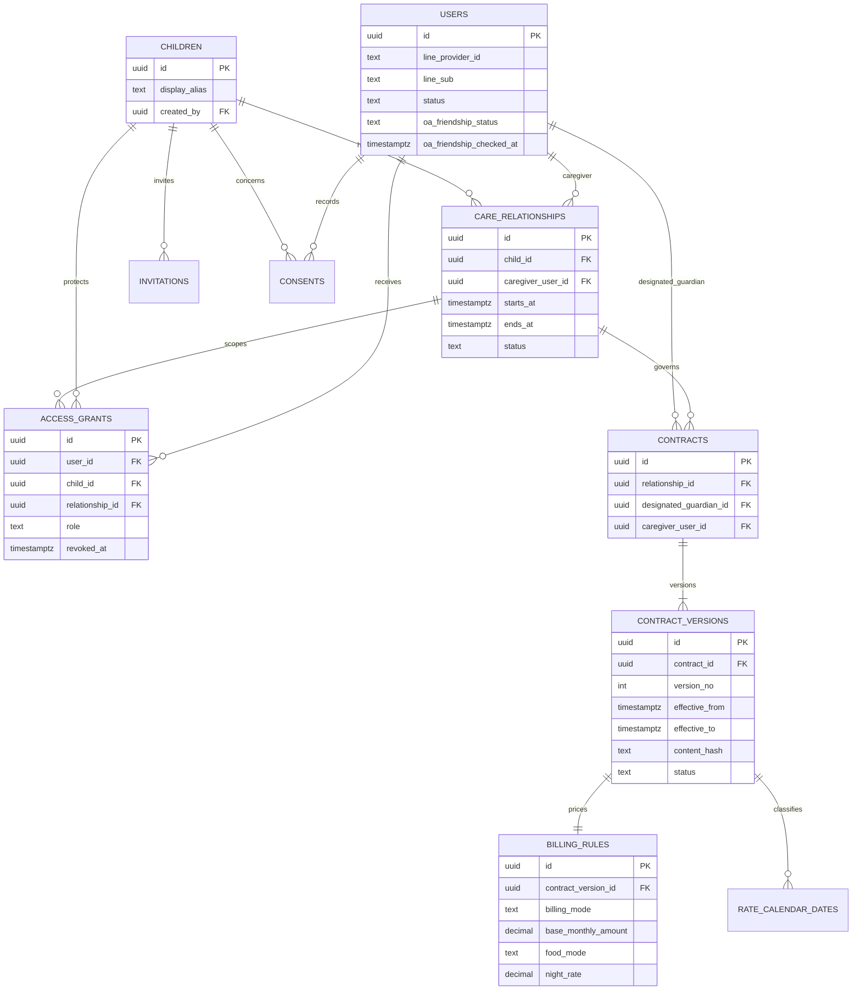
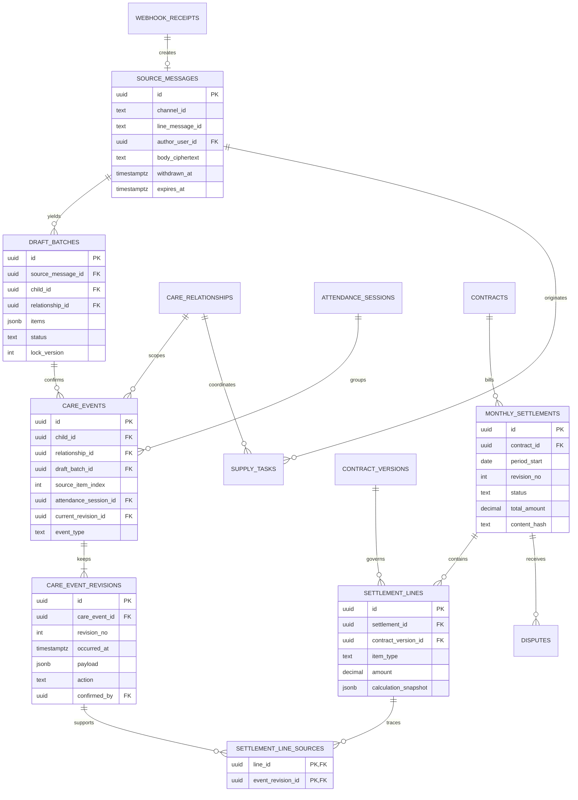

# CareLink ERD

版本：1.2｜2026-09-16｜PostgreSQL 邏輯資料模型，待實作

本模型支援 [PRD](01_PRD_v1.md) 的 P0。身份、照護、契約及帳務採模組分層；v1 可部署在同一 PostgreSQL，並以獨立 schema、資料存取介面與資料庫角色限制權限。同庫分表不等於物理隔離，也不保證匿名化。

## 1. 身份、孩子與契約關係

圖中的 contract_version 與 billing_rule 為一對一，建立草稿時同交易新增。Mermaid 顯示主要關聯；下方資料字典列出未在圖中展開的欄位。`effective_to` 可為 null，表示無既定終止日；版本區間一律前含後不含。

### LINE Provider 配置不變條件

OA 的 Messaging API Channel 與 LINE MINI App Channel 必須建立在同一個 LINE Provider 下。這是 LINE Platform 的部署／身份配置不變條件，不由資料庫外鍵保證；部署檢查需記錄 provider/channel 對應。`users.line_sub` 只在預期的 Provider 範圍內作為 LINE 身分鍵使用，不嘗試跨 Provider 合併使用者。

## 2. 訊息、事件與帳單的追溯關係

`source_message_id`、`draft_batch_id` 可為 null，以支援人工輸入；人工流程仍須明確確認。圖中零或一訊息是指單一 webhook receipt 只建立一次訊息資料，收回 webhook 另外透過 message ID 找到原訊息。

## 3. 共通型別與安全邊界

所有業務 ID 使用 UUID。時間用 `timestamptz` 保存實際時點；月份與 night_date 用 Asia/Taipei 的日期。`created_at`、`updated_at` 記錄系統寫入時間，不替代實際發生時間。

金額以 TWD 計，單價與最終金額使用 `numeric(12,2)`；計時過程用 decimal 或有理數計算，不用二進位浮點數。數量、分鐘及未取整小計可用 `numeric(18,6)` 儲存展示值，但權威計算保留原始整數分鐘與分母 60，避免先取小數造成取整偏差。

照護與契約表不存 LINE token。來源訊息加密；外部 AI 接收最少欄位。日誌只含操作 ID、內部 ID 與狀態，不含訊息全文。私密內容的刪除需清理 payload，`deleted_at` 本身不算完成刪除。

## 4. P0 資料字典

### 4.1 身份與授權

| 表 | 主要欄位 | 約束／用途 |
|---|---|---|
| users | id、line_provider_id、line_sub、display_name_ciphertext、status、oa_friendship_status、oa_friendship_checked_at | UNIQUE(provider_id, sub)；同一人可有多種孩子關係。v1 只接同一 LINE provider 下的渠道。oa_friendship_status (FRIEND / NOT_FRIEND / UNKNOWN) 為 last-known cache，不得當作權威狀態，因使用者可能在 LINE 外部封鎖或解除好友 |
| children | id、display_alias、created_by、created_at、archived_at | 不收地址、證號；完整生日留待有必要目的時再設計 |
| access_grants | id、user_id、child_id、relationship_id nullable、role、scopes、starts_at、ends_at、revoked_at | 家長 grant 可無 relationship；保母 grant 必綁關係。先檢查 grant，再檢查關係有效性 |
| care_relationships | id、child_id、caregiver_user_id、starts_at、ends_at、status | PENDING／ACTIVE／ENDED；ends_at > starts_at；只允許一段有效主托育關係的限制屬 v1 範圍 |
| invitations | id、child_id、inviter_id、token_hash、target_role、shared_via、accepted_by、approved_by、expires_at、consumed_at、status | token_hash 唯一；接受不自動給權限，家長核對後才 ACTIVE。shared_via (SHARE_TARGET_PICKER / COPY_LINK / DIRECT) 記錄邀請來源管道 |
| consents | id、user_id、child_id、purpose、notice_version、accepted_at、withdrawn_at | 保存何人對何目的、哪版說明的選擇；同意不等同自動滿足所有法令要求 |

`access_grants.scopes` 為有限列舉，例如 CARE_READ、CARE_WRITE、HANDOFF_WRITE、CONTRACT_READ、BILLING_READ。契約及帳單的確認權另由 contracts 中的固定當事人決定，不能由一般讀取權升級。

### 4.2 接收、工作及草稿

| 表 | 主要欄位 | 約束／用途 |
|---|---|---|
| webhook_receipts | id、channel_id、webhook_event_id、event_type、event_timestamp、received_at、status | UNIQUE(channel_id, webhook_event_id)；不長期保存整包 webhook 原文 |
| source_messages | id、receipt_id nullable、channel_id、line_message_id、author_user_id、body_ciphertext、received_at、withdrawn_at、expires_at | UNIQUE(channel_id, line_message_id)；允許無 body 的收回 tombstone，阻止亂序重送復活原文 |
| jobs | id、kind、dedupe_key、payload_refs、status、attempts、next_run_at、lease_until、last_error_code | UNIQUE(kind, dedupe_key)；DB 作業佇列及通知 outbox 共用，payload 只放參照 ID |
| draft_batches | id、source_message_id nullable、child_id、relationship_id、created_by、items、status、lock_version、expires_at、prompt_version、schema_version、model_id、correction_target_id nullable | items 受 JSON schema 驗證；同一訊息可有草稿修訂，但最多一個有效候選批次 |

`jobs.kind` 支援 EXTRACT、SEND_NOTIFICATION、PURGE_RAW、RECALCULATE。通知工作保存 recipient_user_id、resource_id 與 content_version 參照，發送當下重新檢查授權；不得把整份孩子資料塞入佇列。

`draft_batches.items` 的單筆欄位為 `item_index, event_type, occurred_at, payload, missing_fields, source_span`。source_span 為短期定位資訊，隨原文刪除；不把它複製到永久 audit log。AI 回傳的 child token 只能由後端對照已授權的孩子，不能直接信任模型提供的 UUID。

### 4.3 照護與交班

| 表 | 主要欄位 | 約束／用途 |
|---|---|---|
| care_events | id、child_id、relationship_id、draft_batch_id nullable、source_item_index nullable、attendance_session_id nullable、event_type、current_revision_id、created_by | UNIQUE(draft_batch_id, source_item_index)；current_revision_id 必須屬於本事件 |
| care_event_revisions | id、care_event_id、revision_no、occurred_at、payload、action、supersedes_revision_id nullable、confirmed_by、confirmed_at、reason | UNIQUE(event_id, revision_no)；只存已確認版本；action=RECORD／CORRECT／VOID |
| attendance_sessions | id、relationship_id、status、check_in_event_id、check_out_event_id nullable、lock_version | CHECK_IN 與 CHECK_OUT 必須屬同一孩子與關係；關閉前要求正時長、不重疊 |
| supply_tasks | id、relationship_id、source_message_id nullable、created_by、assigned_to、item_name、quantity、due_at、status、acknowledged_at、packed_at、received_at、lock_version | 負責人須有孩子授權；由家長準備、保母收訖，不能越級代確認 |

事件類型與最少 payload：

| event_type | payload | 計費用途 |
|---|---|---|
| FEED | amount_ml > 0 | 無，不當作餐數 |
| SLEEP_START／SLEEP_END | sleep_pair_id；結束需配對有效開始 | 無；缺結束不估算時長 |
| CHECK_IN／CHECK_OUT | 實際時間放 occurred_at；接送備註最小化 | 建立出勤分鐘與月托逾時 |
| PLANNED_PICKUP | planned_at、pickup_label、acknowledged_by、acknowledged_at | 無；不改寫 CHECK_OUT |
| MEAL | count 正整數、meal_label、service_date | 僅 PER_MEAL 收費；MONTHLY 只作照護紀錄 |
| NIGHT_STAY | night_date、start_at、end_at、count=1 | 每晚一筆，依契約取夜價；不以跨日推論 |

同一關係、同一 night_date 的有效 NIGHT_STAY 最多一筆。若需多夜，建立多筆。新增修訂與切換 current_revision_id 在同一交易完成；一般編輯禁止 UPDATE 舊 revision 的內容。

### 4.4 契約與計費政策

| 表 | 主要欄位 | 約束／用途 |
|---|---|---|
| contracts | id、relationship_id、designated_guardian_id、caregiver_user_id、status | 每份契約固定兩位確認者；一段有效期間不可有重疊生效契約 |
| contract_versions | id、contract_id、version_no、effective_from、effective_to、schedule_json、terms_json、content_hash、status、guardian_ack_hash、guardian_ack_at、caregiver_ack_hash、caregiver_ack_at | UNIQUE(contract_id, version_no)；已確認條件不可覆寫；兩方 hash 必須等於 content_hash |
| billing_rules | id、contract_version_id、billing_mode、base_monthly_amount、late_unit_minutes、late_unit_rate、weekday_hourly_rate、holiday_hourly_rate、night_rate、food_mode、food_monthly_amount、food_per_meal_rate、rounding_policy、night_policy、partial_month_policy、timezone、policy_status | UNIQUE(contract_version_id)；有類型與模式交叉驗證，不使用任意可執行字串 |
| rate_calendar_dates | id、contract_version_id、local_date、day_type、source_note、confirmed_by、confirmed_at | UNIQUE(version_id, local_date)；day_type=WORKDAY／HOLIDAY；確認後修改會建立新契約政策版本 |

完整日期費率表覆蓋欲出帳期間。建立時可由週六日規則預填，保母再核對國定假日或補班日期；未確認的日期不能供 TEMP 計費。每筆明細保存日別及來源快照，不受後續日曆改動影響。

FIXED 必填 base_monthly_amount、schedule、late_unit_minutes=30、late_unit_rate=98，TEMP 必填 weekday_hourly_rate=196、holiday_hourly_rate=200。這些初始值由使用者提供，後續可透過新版本更改。資料庫不依暱稱自動挑選費率。

`food_mode` 為 MONTHLY／PER_MEAL，TEMP 僅 PER_MEAL。`night_policy` 可為 UNRESOLVED／ADDITIVE／REPLACES_OVERLAP；v1 先實作 UNRESOLVED 阻擋與明確 ADDITIVE，REPLACES_OVERLAP 須完成另行定義的時段排除測試後才開放。`partial_month_policy` v1 為 BLOCK。未開放的政策不能只靠改資料庫列舉就投入計算。

### 4.5 帳單、證據與稽核

| 表 | 主要欄位 | 約束／用途 |
|---|---|---|
| monthly_settlements | id、contract_id、period_start、revision_no、supersedes_id nullable、status、currency、total_amount、delta_from_previous、engine_version、input_hash、content_hash、blocking_reasons、published_by、published_at、guardian_ack_hash、guardian_ack_at、locked_at | UNIQUE(contract_id, period_start, revision_no)；保母出帳與家長同意同一 hash 才鎖定 |
| settlement_lines | id、settlement_id、contract_version_id、item_type、quantity、unit、unit_rate、amount、calculation_snapshot、line_key | UNIQUE(settlement_id, line_key)；明細加總必等於 total_amount |
| settlement_line_sources | line_id、event_revision_id | 複合主鍵；每個引用版本必須屬同一契約關係。基本費／月伙食可無事件來源 |
| disputes | id、settlement_id、line_id nullable、created_by、reason、status、resolution、resolved_by、resolved_at | OPEN 未解決時不可鎖帳；使用者只能爭議自己有權看的帳單 |
| audit_logs | id、actor_user_id nullable、action、resource_type、resource_id、resource_version、request_id、occurred_at、metadata_minimal | 應用角色只能 append；保留修改原因與版本參照，避免複製敏感原文 |

`calculation_snapshot` 明列事件時點、分鐘、段落日別、費率、契約條件、政策選擇、計算前數值、取整結果及規則版本。基本費來源是契約；延托、計時、餐數和夜數來源是已確認 revision。audit log 只記「使用了哪些版本」，不另存一份完整 payload。

每個 session 的 TEMP 計時明細先在跨午夜或費率邊界切段，合計後按 D01 取整，存成一行含 segments 的明細。如此不會因切成多行而多次四捨五入。夜費與餐費為獨立明細。

## 5. 狀態與不變條件

| 對象 | 狀態 | 不變條件 |
|---|---|---|
| DraftBatch | NEEDS_INPUT → PENDING_CONFIRMATION → CONFIRMED；另有 CANCELLED／EXPIRED／INVALIDATED | 只有 PENDING_CONFIRMATION 能確認；缺欄位、過期、收回或撤權全部拒絕 |
| ContractVersion | DRAFT → PENDING_ACK → AGREED；另有 VOID | AGREED 按日期判斷是否適用；內容不再編輯，變更建立新版 |
| AttendanceSession | OPEN → CLOSED；另有 VOID | CLOSED 有成對有效實際事件；重算讀當前已確認 revision |
| MonthlySettlement | DRAFT／BLOCKED → PENDING_GUARDIAN → LOCKED；另有 DISPUTED／SUPERSEDED | 每次來源變動產生新修訂，舊內容保留；爭議先解決才能重出帳 |
| Job | READY → RUNNING → SUCCEEDED；失敗為 RETRY／DEAD | lease 過期可重領；業務唯一鍵防止重做造成重複資料 |

鎖定帳單不能直接 UPDATE 金額。更正建立下一 revision，引用前一張、顯示差額，重新由雙方確認。所有帳單的來源 revision 固定，care_event.current_revision_id 日後更動不改舊帳。

`contract_version` 生效範圍不可重疊，可透過 PostgreSQL range exclusion constraint 或在鎖住 contract 後的交易檢查實作。關係、孩子、事件、契約與帳單的交叉一致性不可只靠前端：使用複合外鍵、資料庫約束或明確的交易驗證防止混接。

## 6. 交易與索引

確認草稿時鎖住草稿，驗證 lock_version、操作者、期限與來源狀態；寫入事件、首版 revision、audit、通知 job 後才提交。並行按鈕或網路重送得到同一結果。

出帳時鎖住 contract 的計費範圍，擷取當前事件 revision 與 AGREED 契約版本，計算 input_hash。產生明細後再次確認來源未變；若變動則重試。來源修訂必須使既有待確認帳單失效，家長不能確認過期內容。

| 查詢／約束 | 索引或交易策略 |
|---|---|
| 某孩子時間軸 | care_events(child_id, relationship_id)；revisions(occurred_at, care_event_id) |
| 查有效授權 | access_grants(user_id, child_id, revoked_at) |
| 查待執行工作 | jobs(status, next_run_at)；FOR UPDATE SKIP LOCKED 與 lease |
| LINE 去重 | webhook_receipts(channel_id, webhook_event_id) UNIQUE |
| 防止重複正式事件 | care_events(draft_batch_id, source_item_index) UNIQUE |
| 每月帳單版本 | monthly_settlements(contract_id, period_start, revision_no) UNIQUE |
| 每晚重複 | 確認 NIGHT_STAY 時鎖 relationship＋night_date 並檢查有效事件 |
| 出勤重疊 | 鎖 relationship 後檢查完整時段，不只比較時分 |

## 7. 保存、刪除與後續擴充

來源原文、草稿、工作 payload、正式紀錄採不同期限。收回 webhook 即使先於原始訊息到達，也先建立 withdrawn tombstone，後到的原始訊息不得重建可讀原文。保存數值及清理流程見 [System Architecture](04_System_Architecture.md)。

append-only 表示一般業務操作不能覆寫歷史，不表示資料永久不能刪。到期或經審核的刪除流程由獨立維護角色執行，保留不含兒童內容的刪除紀錄；也需處理備份到期與還原後重新清理。

後續需要檔案時另增 documents 與私有物件儲存；需要政府授權介接時另增 integration_jobs 與欄位映射。這些表不列 P0 migration。RAG、向量資料庫、醫療資料庫與付款表也不為本次 Demo 預先建空殼。

P0 不為 Rich Menu 狀態或 MINI App session 建立獨立 domain table。Rich Menu 由 OA 管理，MINI App 入口來源若需追蹤，透過既有 audit_logs 或 telemetry 事件記錄即可，不在核心 domain 加表。原則：Domain Database 只存產品需要的權威狀態。

