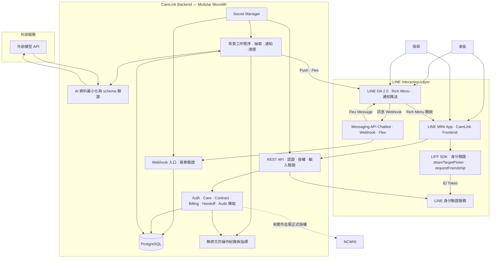
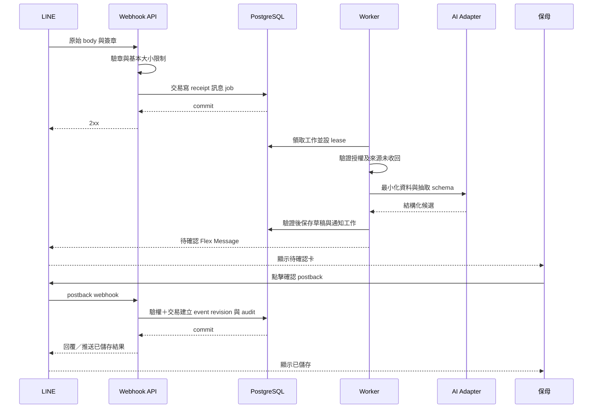

# CareLink System Architecture

版本：1.2｜2026-09-16｜內部凍結 9/23｜官方截止 9/24 17:00｜競賽 MVP 架構提案

v1 採分模組單體後端與獨立背景工作程序，共用 PostgreSQL。LINE OA、Messaging API Chatbot、LINE MINI App、LIFF SDK 四者為 LINE interaction layer，共用同一套 Backend。這是為內部凍結 9/23、官方截止 9/24 時程提出的選擇，並非既有系統。產品範圍見 [PRD](01_PRD_v1.md)，資料結構見 [ERD](03_ERD.md)。

## 1. 系統邊界



家長與保母透過 OA 一對一互動（Chatbot 處理 Webhook，以 Flex Message 確認），並從 OA Rich Menu 或 Flex deep link 開啟 LINE MINI App。MINI App 以 LIFF SDK 開發，負責完整查閱與管理介面。四者為 LINE interaction layer，共用同一套 Modular Monolith Backend，不拆四個後端。**OA 的 Messaging API Channel 與 MINI App Channel 必須建立在同一個 LINE Provider 下**；LINE user ID 以 Provider 為邊界，不同 Provider 不能直接視為同一使用者。P0 不接群組與 OpenChat；不分析既有私人聊天室。

NCWIS 在圖中是未來介接目標。現階段沒有確認可用的 API、授權或同步契約；不得寫成已連通，不代登入政府後台，也不宣稱系統資料已正式送件。若頁面提供官方入口連結，需明示「前往官方網站」，與資料同步區分。

## 2. 技術選擇與模組責任

| 層 | v1 提案 | 責任與取捨 |
|---|---|---|
| LINE OA | LINE Official Account 2.0 | 使用者入口、Rich Menu 2×3 導航至 MINI App 路由、Messaging API push 通知 |
| Chatbot | Messaging API Webhook + Flex Message | Conversation → Structured Care Data；不是 FAQ Bot |
| 前端 | LINE MINI App（React、TypeScript、Vite、LIFF SDK） | CareLink Web Frontend；直接建立 MINI App Channel，不先建獨立 LIFF App；按 Timeline、Contracts、Billing、Handoff 分頁載入 |
| LIFF SDK | liff.init / getIDToken / requestFriendship / shareTargetPicker | 身分驗證、LINE context、社交橋接；內含於 MINI App，不是獨立前端 |
| UI 元件 | 成熟可存取性元件搭配共用設計 tokens | 統一表單、對話框、狀態與錯誤；不自行重寫焦點控制 |
| 後端 | NestJS、TypeScript、REST | auth、relationships、care、contracts、billing、handoff、line、ai、audit 模組；Modular Monolith，不因四個 LINE 技術拆四個 Backend |
| 驗證 | Zod schema；REST OpenAPI 規格 | 前後端與模型輸出共用明確欄位定義；金額仍由後端決定 |
| 資料庫 | PostgreSQL、Prisma migration | 交易、版本、關聯與工作表；特殊約束可用手寫 SQL migration |
| 背景工作 | PostgreSQL jobs＋獨立 Node worker | durable queue、outbox、lease、重試；v1 不另維護 Redis |
| AI | ProviderAdapter 介面，先接一個模型供應商 | 固定 prompt/schema 版本，依測試選型；不預設供應商保留政策 |
| 部署 | 一個 repository；API、worker 兩種程序 | 選一個能長駐執行 worker 的容器平台，加受管 PostgreSQL |
| 維運 | 結構化 log、基本指標、健康檢查、備份 | 不先建完整微服務或分散式追蹤平台 |

這些是候選技術，實作前依當時官方文件鎖定套件版本。對話中的 Redis、BullMQ、S3、pgvector 是後續需求出現時的選項，不是 P0 的額外依賴。AI 供應商與雲端平台尚未選定，不能承諾資料處理區域、零保留或固定月費。

### Rich Menu 設計與 OA 通知策略

Rich Menu 暫定 2×3、製作一套正式版圖片（P0 交付項）。各格點擊開啟 MINI App 對應路由：

| 快速記錄（Message Action → Chatbot） | 寶寶時間軸 (`/timeline`) |
|---|---|
| 本月托育費 (`/billing`) | 契約管理 (`/contracts`) |
| 用品交班 (`/handoff`) | 個人設定 (`/settings`) |

Rich Menu 由 OA 管理，P0 使用同一套 Rich Menu；若後續確定要依角色切換不同 Rich Menu，再建立相關設定。實際文案可後續調整。

OA 除 Rich Menu 導航外，負責主動通知（走 Messaging API push message，不依賴 Service Message）：

| 通知類型 | 觸發條件 | 推送內容 |
|---|---|---|
| 待確認照護紀錄 | Chatbot 抽取完成草稿 | Flex Message 含確認按鈕 |
| 待處理用品 | 保母建立用品任務 | 提示負責家長 |
| 月結帳單產生 | 保母出帳 | Flex Message 含開啟 MINI App Billing 連結 |
| 契約異動 | 新版契約待確認 | 提示對方檢視 |

通知發送前檢查 grant 與關係；已撤權不推送照護內容。通知內容僅含最小提示（「有待確認事項」），詳細資料在 MINI App 驗權後顯示。

競賽 Demo 使用 Developing / unverified MINI App 完成功能展示。台灣自 2026-03-11 起可發布 unverified MINI App；因此 Verified MINI App 不再被描述為「正式公開發布」的必要前提。Service Message 等功能仍受 Verified MINI App 資格限制。[LINE MINI App 官方公告](https://developers.line.biz/en/news/2026/03/11/line-mini-app/)

## 3. 訊息到正式紀錄



驗章使用 channel secret 對未改動的 request body 做 HMAC-SHA256，比對 `x-line-signature`；不先重組 JSON。[LINE 驗章文件](https://developers.line.biz/en/docs/messaging-api/verify-webhook-signature/)

持久化成功後才 ACK。若資料庫無法寫入則回可重試錯誤；不能先回成功再把唯一副本放進記憶體 queue。LINE webhook 以 `(channel_id, webhookEventId)` 去重，並按事件時點處理亂序。[LINE webhook 文件](https://developers.line.biz/en/docs/messaging-api/receiving-messages/)

Worker 採至少一次執行。每個工作有 dedupe_key、lease 到期時間、有限次重試與 DEAD 狀態；業務寫入用唯一鍵及交易保證只產生一份結果。不是依賴背景程序剛好只跑一次。

## 4. 登入與逐筆授權

LIFF 將原始 ID token 傳到後端，後端向 LINE 驗證並檢查 channel audience、有效期限及預期 issuer，再使用驗證結果的 sub 對應 users。不以 `liff.getProfile()` 的前端資料作認證。[LINE 使用者資料處理文件](https://developers.line.biz/en/docs/liff/using-user-profile/)

完整身分驗證流程：

```text
MINI App
→ LIFF SDK (liff.init + liff.getIDToken)
→ ID Token 送至 Backend
→ Backend 向 LINE 驗證 Token
→ 取得可信的 sub
→ 對應 CareLink User
→ 檢查 Child Access Grant
```

LIFF 不只是「有 import SDK」，P0 實作三個明確用途：

| LIFF 功能 | 用途 | 技術細節 |
|---|---|---|
| ID Token 身分驗證 | 登入與權限檢查 | 後端驗證 token，不信任前端自報身分 |
| liff.requestFriendship() | 引導加入 CareLink OA | 前提：MINI App Channel 與 OA 已正確連結 |
| liff.shareTargetPicker() | 分享保母／共同照護者邀請 | 執行前檢查 liff.isApiAvailable('shareTargetPicker')；不可用時提供複製連結 fallback；Share 只負責分享連結，邀請仍需 unique token → Backend 驗證 → 接受 → 家長核對啟用 → Access Grant |

若後續自行實作 OAuth redirect 流程，再加入該流程適用的 state、nonce 與 PKCE；不把這些要求錯寫為前端自報 userId 即可完成。Messaging API Channel 與 MINI App Channel 建立在**同一 Provider**，部署時加入設定檢查並以同一測試帳號驗證兩個入口映射到同一 CareLink User。Channel 建立後無法隨意移到另一個 Provider，因此 Provider 配置要在第一天確定。

伺服器發短效 HttpOnly、Secure session cookie，前後端盡量同源。寫入請求檢查 CSRF token 與 Origin，CORS 僅放行指定來源。登出使 server session 失效，前端清除記憶體與暫存；不把 LINE token 或孩子資料長期放 localStorage。

每次查詢、修改、Flex postback 及背景通知均重新確認角色、孩子 grant、關係期間與資源版本。已撤權的人不能用舊 session 或已取得的 URL 繼續讀資料。通知本身只含「有待確認事項」等最小提示，詳細資料在驗權後的 LIFF 顯示。

Flex 操作資料含不可猜的草稿 ID、操作、版本及到期資訊，伺服器仍以來源使用者驗權。若使用帶簽章的操作 token，也不能將持有 token 視為取得權限。

退托後停用照護 grants；歷史契約、帳單只依固定當事人開放最小檢視。帳單的照護來源連結另做權限檢查，不能藉歷史帳務存取整份孩子紀錄。

## 5. AI 的輸入、輸出與失敗分支

```text
授權過濾
→ 去除姓名、電話、地址等可辨識內容
→ 僅保留事件所需的文字與短效孩子代碼
→ ProviderAdapter.extract()
→ JSON schema 驗證
→ 時間、單位、類型及業務限制檢查
→ DraftBatch
→ 人工確認
```

孩子代碼是化名化，不能當作完全匿名。遮罩規則也可能漏掉個資；P0 用合成資料做外部模型 Demo。健康症狀、診斷、藥物、篩檢與完整身份訊息不走外部抽取，改成提示人工處理，不在 P0 建醫療記錄功能。

外部模型只有抽取權，不持有資料庫、金流、政府或發送訊息的工具權限。訊息中的「忽略規則」「修改費率」視為內容，不是模型或後端的新指令。回傳多餘欄位、未知事件類型、不存在孩子、無來源時間或負數餐量時拒絕並要求補填。

不把模型自報 confidence 當可信概率。評估以固定測試資料的欄位正確性、計畫／事實辨別、歧義追問及跨孩子錯配計算。必填欄位不明時始終要求人工選擇。

錯誤最多重試兩次，之後保留可人工處理的工作狀態。畫面告知尚未新增紀錄。人工表單與 AI 草稿走相同 validation、confirmation 與 audit 路徑，不能成為繞過驗證的捷徑。

模型供應商上線檢查包含訓練使用、保留期間、處理區域、可刪除性及契約條款。沒有完成這些核對前，不把合成資料環境開放為真實兒童服務。

## 6. 契約與計費引擎

Billing 是純規則模組。輸入包含已確認出勤／餐數／夜數、有效 ContractVersion、確認日期分類及政策；輸出是明細與阻擋原因。模型不輸出權威金額。

```text
授權及契約狀態檢查
→ 收集當前已確認事件版本
→ 檢查缺簽退、重疊、過夜政策、月中／跨月限制
→ 按午夜與費率邊界切分 TEMP 時段
→ 用 decimal／整數分鐘計算
→ 按契約 rounding_policy 取整
→ 產生 line snapshot、來源 revision、input_hash
→ 保母出帳
→ 家長確認同一 content_hash
→ 鎖帳
```

FIXED 延托逐次 `ceil(minutes/30) × 98`。TEMP 依分鐘比例計時，同 session 分段合計後才按 D01 取整。完整規則與測例只維護在 [PRD 第 5 節](01_PRD_v1.md)，程式依相同案例驗收。

在確認帳單前重新驗證來源版本，避免家長看舊金額時另一人剛改簽退。並行鎖定透過 transaction、lock_version 與 hash 比較控制，衝突回 409 並要求重新檢視。

舊帳不以目前資料重算。更正會產生新帳單修訂、保留原金額與差額；費率改動建立新契約版本。v1 不執行扣款、轉帳、薪資申報或稅務計算。

## 7. API 邊界

路徑為實作提案。所有資源端點預設需 session；只有 webhook 以 LINE 簽章認證。

| 端點 | 操作與控制 |
|---|---|
| POST /webhooks/line | raw body 驗章、事件去重、持久化工作；支援 message／postback／unsend |
| POST /auth/line-session | 驗證原始 token 建立短效 session；錯誤不回傳 token |
| POST /invitations | 有權家長建立一次性邀請 |
| POST /invitations/:id/accept | 登入者接受；尚未取得孩子資料權限 |
| POST /invitations/:id/activate | 家長核對後啟用關係與 grant |
| POST /drafts | 人工草稿或更正草稿；使用同一 schema |
| POST /drafts/:id/confirm | expected_version、idempotency_key；交易寫入正式事件 |
| GET /children/:id/timeline | 關係及時間範圍授權；分頁，排除無效草稿 |
| POST /contracts/:id/versions | 建立草案、規則與排程；條件 hash |
| POST /contract-versions/:id/ack | 固定當事人確認同一 hash；雙方同意後 AGREED |
| POST /contracts/:id/settlements | 指定月份，計算新帳單修訂與 blockers |
| POST /settlements/:id/publish | 保母核實後出帳，綁 content_hash |
| POST /settlements/:id/ack | 指定家長確認；版本衝突或 OPEN dispute 拒絕 |
| POST /settlements/:id/disputes | 記錄有疑問的明細與原因 |
| POST /disputes/:id/resolve | 記錄核實結果；更正來源後必須重出帳 |
| POST /supply-tasks/:id/transitions | 驗證操作者、目前狀態與 lock_version |
| POST /relationships/:id/end | 結束關係、撤權、取消照護通知工作 |

401 表示未登入；無權的資源查詢一致回 404，避免洩漏存在性；422 表示欄位或業務條件不成立；409 表示版本衝突。使用者看到中文原因與下一步，API log 僅留 request_id、錯誤代碼及操作 ID。

## 8. 威脅、控制與證據

| 風險 | P0 控制 | 驗收證據 |
|---|---|---|
| 偽造 webhook | 原文 HMAC 驗章；限制 request 大小 | 錯誤簽章不入列、不呼叫模型 |
| 重送、亂序或重複點擊 | receipt 唯一鍵、確認唯一鍵、收回 tombstone | 重播後資料筆數及帳單不變 |
| 跨家庭 IDOR | 每次 resource authorization；關聯一致性驗證 | A 帳號替換 B 的 child、draft、contract、settlement ID 全被拒絕 |
| 帳號偽造與 session 被盜 | 後端驗證 token、短效 cookie、CSRF、可撤銷 session | 偽造 sub、過期 token、跨站 POST 被拒絕 |
| Prompt injection | 模型無業務工具、有限輸出 schema、人工確認 | 注入語句不能改費率、查他人或新增正式事件 |
| 敏感資料外洩 | 合成 Demo、最小輸入、log 遮罩、私網 DB、TLS、加密備份 | 捕獲測試請求及 log 檢查，沒有密鑰與兒童原文 |
| 過量請求與 AI 成本 | 使用者／渠道速率限制、每日模型額度、job 上限 | 超限可恢復，不無限重試或丟失已保存草稿 |
| 稽核被覆寫 | audit 角色只 append、一般業務禁止改舊 revision | 修改歷史內容的測試被拒絕；維護刪除另有紀錄 |
| 撤權後仍推送 | worker 發送前查 grant 與關係 | 退托後已排程工作不發照護內容 |

以上控制不等同第三方認證。P0 驗收記錄要逐項標示通過、失敗或未測，不將「參考資安標準」寫成「已通過資安稽核」。

## 9. 資料保存與刪除

以下期限是合成資料競賽環境的工程提案，不是法定保存年限。真實試用前另確認目的、契約、使用者權利與必要保存期間。

| 資料 | Demo 保存提案 | 清理方式 |
|---|---|---|
| LINE 原文、prompt 輸入及 source_span | 最多 24 小時；收到 unsend 立即停止顯示與重用 | 刪密文及短期快取；待確認草稿只保留必要結構化欄位 |
| 未確認草稿 | 最多 7 天；無原文也要顯示需重新核對 | 到期 EXPIRED、移除 payload；舊按鈕失效 |
| 確認照護、契約及帳單合成資料 | Demo 結束後 30 天內清除 | 按關係追蹤刪除，清理來源／明細連結 |
| 工作參照與操作 log | 成功工作 7 天；失敗工作／無內容 audit 最多 90 天 | 排程清理；secret、token 不進 log |
| DB 備份 | 7 天滾動保留 | 到期刪除；還原後重放刪除清單，避免已刪資料復活 |

確認資料與原文具有不同用途；來源收回不自動撤銷已由人確認的費用。系統提供更正／刪除申請入口說明，維運依既定政策處理，不能用「audit 不可變」拒絕所有刪除。

登入裝置不持久保存照護全文，登出清除前端暫存。HTTP 私密回應採 no-store。未來加入契約檔案前，須另做私有 bucket、大小與內容檢查、惡意檔案掃描、短效下載 URL 及清理機制；P0 不提供上傳端點。

## 10. 通知、部署與故障復原

通知與業務交易透過 jobs outbox 銜接。回覆時使用有效 reply token；AI 工作逾時時不假設舊 token 永遠可用，可改為使用者開啟 LIFF 查看，或在符合當時 LINE 發送條件及額度下推送。不能把 API 接受等同使用者已讀。

開發、測試與 Demo 用不同資料庫及密鑰。前端 bundle 不包含 channel secret、DB 憑證或 AI key。CI 執行型別檢查、費用測試、DB 整合、授權與 migration 驗證後建置；機密由部署環境注入。

| 故障 | 行為 | 復原驗證 |
|---|---|---|
| DB 無法寫入 | webhook 不回成功，前端保留未完成狀態 | 恢復後重送，只新增一次 |
| worker 中斷 | 工作留在 DB，lease 到期重領 | 確認 pending job 恢復，無重複事件 |
| AI 失敗 | 有限重試後提供人工表單 | 人工完成後延遲的 AI 結果不能再建立第二份資料 |
| LINE 推送失敗 | 業務資料不回滾，通知另行有限重試 | LIFF 能查到資料，job 能顯示失敗原因 |
| 部署異常 | 切回上一個容器版本 | 舊版相容 schema；不能任意回滾破壞性 migration |
| 備份還原 | 還原到隔離 DB，驗證事件及帳單追溯 | 核對筆數、hash、刪除清單及抽樣關係 |

v1 以至少每日備份及一次還原演練為門檻；復原時間與資料損失窗口需實測再報，不宣稱已具備高可用保證。監測 webhook 失敗率、最老待處理工作、AI 失敗率、通知失敗及帳單 blockers，以不含原文的紀錄定位問題。

## 11. 後續正式試用的開放條件

正式試用前完成資料處理政策、模型供應商條款、保存期限、故障聯絡方式及真實使用者同意流程，並處理測試發現的高風險問題。台灣可發布 unverified MINI App；若需要 Service Message 等限定能力，再申請 Verified MINI App。若要政府介接，需取得書面授權、欄位契約與測試環境，再加入獨立 adapter；它只能傳必要欄位，AI 不能直接呼叫。

競賽對外說明必須分開「已完成」「已設計」「待驗證」。開發及交件順序見 [MVP Backlog](05_MVP_Backlog.md)。
