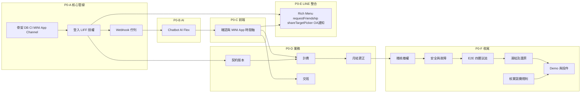

# CareLink MVP Backlog

版本：1.2｜2026-09-16｜內部凍結目標：2026-09-23｜官方截止：2026-09-24 17:00，Asia/Taipei

本待辦以 [PRD](01_PRD_v1.md) 的 P0 為基準。五份文件是本次產出，以下程式、測試、部署、訪談、影片與實際投件均尚未完成。估時是規劃值，不是工時紀錄。

## 1. 交件成果與完成定義

9/23 內部凍結前的產品目標是跑通四條可操作流程：

1. OA Chatbot → AI 草稿 → Flex 確認 → PostgreSQL → 家長在 MINI App 查看時間軸。
2. 實際出勤／餐數／夜數 → 契約版本 → FIXED／TEMP 計算 → 月結確認。
3. 下月契約 V2 生效 → 下月用新條件 → 已鎖定的舊月仍保留 V1 依據。
4. OA Rich Menu → LINE MINI App → LIFF 身分驗證 → Timeline / Contract / Billing / Handoff 查閱。

交班用品提供最小狀態流程。自動提醒與生成式摘要排在 P1；PDF OCR、電子簽章、政府介接、媒合與 Service Message（需 Verified MINI App）另列後續。台灣可發布 unverified MINI App，因此「是否公開發布」不再綁定 Verified；競賽期間仍以 Developing / unverified 流程為主。9/24 僅做最終 QA、附件與連結檢查及投件，不安排核心功能開發。

所有 P0 的 Done 都要求：功能可操作、資料在後端保存、負向測試通過、錯誤可恢復、沒有外洩原文或密鑰、文件與實際行為一致。只做靜態畫面不能標 Done。

五份 Markdown 是需求與工程文件，不是比賽的全部必交附件。依目前競賽資訊，初賽必備材料包含指定切結／同意文件、**10 頁內簡報 PDF（不含封面底）**與 **3 分鐘內 DEMO 影片 YouTube Link**；B00 仍需核對單人參賽限制、表單版本與實際上傳欄位。

## 1.1 初賽 Golden Path（先完成、再擴充）

P0 規格保持完整，但一人開發不得平均分配時間。9/18 前先讓以下單一路徑真的跑通，後續功能才有資格擴充：

```text
OA Rich Menu / Chatbot
→ LIFF 身分驗證
→ 保母傳「11:40喝150，13:10睡著」
→ Messaging API Webhook
→ AI extraction + schema validation
→ Flex 人工確認
→ PostgreSQL
→ 家長 MINI App Timeline
→ 18:31 CHECK_OUT
→ Contract Rule Engine
→ 31 分鐘逾時 = 196 元
→ MINI App Billing
→ OA 帳單通知回到 MINI App
```

用品完整狀態、所有 TEMP／過夜 edge case、帳單爭議、V2 契約換版仍按 P0 規格設計與測試；若工時落後，不得犧牲 Golden Path、四個 LINE 技術、後端／資料庫、人工確認、授權與計費正確性去換取更多表面功能。

## 2. 工作清單

人力暫按一名主要開發者規劃；「產品確認者」與「測試參與者」是待安排角色，不代表已有其他成員。各項起始狀態為 TODO；本次文件工作另記於第 8 節。

優先順序分層（不要讓 Rich Menu 美工或 Share Target Picker 阻塞最重要的 Vertical Slice）：

- **P0-A**：OA + Messaging API + Webhook + Backend + PostgreSQL
- **P0-B**：AI extraction + Flex confirmation
- **P0-C**：MINI App + LIFF authentication + Timeline
- **P0-D**：Contract + Billing
- **P0-E**：Rich Menu + requestFriendship + Share Target Picker invitation
- **P0-F**：Security / negative tests / Demo

| ID | 優先 | 工作與負責角色 | 估時 | 依賴 | 可驗收的完成條件 |
|---|---|---|---|---|---|
| B00 | P0-A | 核對競賽規則；提案人 | 0.5–1h | 無 | 固定官方截止 9/24 17:00、簡報 PDF 10 頁內、DEMO ≤3 分鐘、五項各 20%；補核對單人參賽限制、切結書版本與實際上傳欄位 |
| B01 | P0-A | 訪談與政策收斂；提案人＋保母 | 2–3h | 無 | 確認真實工作流程及 PRD D01–D09；記錄尚未決定項，建立合成測試資料，不捏造訪談結果 |
| B02 | P0-A | Repository、部署骨架、migration 與 LINE Provider／Channel 設定；開發者 | 4–5h | 五份規格 | API／worker 啟動，測試 DB migration 可重建，密鑰由環境注入，CI 能 build；OA Messaging API Channel 與 MINI App Channel 建在同一 Provider；MINI App Developing 模式可用 |
| B03 | P0-A | 身份與孩子授權（LIFF SDK 整合）；開發者 | 5–7h | B02 | MINI App → LIFF ID token → 後端驗證 → LINE sub → CareLink User → Access Grant；家長邀請、保母接受、家長核對啟用；跨家庭及撤權測試通過；涵蓋 FR-01 |
| B04 | P0-A | Webhook、DB queue 與收回；開發者 | 3–4h | B02、B03 | 驗章後交易寫 receipt/message/job 才 ACK；重送不重複；unsend 先到也不復活原文 |
| B05 | P0-B | AI 抽取與人工備援（Chatbot: Conversation → Structured Care Data）；開發者 | 4–6h | B04、B01 | 接通一個模型，Webhook → AI extraction → schema validation → Draft → Flex Message 確認；30 句 eval；失敗可人工填寫；FR-02 |
| B06 | P0-C | 確認流程與 MINI App 時間軸；開發者 | 4–6h | B03、B05 | 確認卡與手動表單共用規則；交易保存 revision，雙擊不重複；家長從 Rich Menu 開啟 MINI App 看見已確認紀錄；FR-03、FR-10 |
| B07 | P0-D | 契約與費率版本（MINI App Contract 頁）；開發者 | 4–5h | B03、B01 | MINI App 內 FIXED／TEMP 表單、雙方確認同一 hash、排程與有效區間；新版不覆蓋舊條件；FR-04 |
| B08 | P0-D | 接送計畫與用品交班（MINI App Handoff 頁）；開發者 | 2–3h | B06 | 計畫不當作簽退；用品由指定家長準備、保母收訖；角色及狀態跳轉受控；FR-07 |
| B09 | P0-D | 出勤與計費引擎；開發者 | 6–8h | B06、B07 | 簽到退配對、餐／夜事件、日期費率、decimal、D01 取整、blockers；PRD 計費案例全部通過；FR-05 |
| B10 | P0-D | 月結、爭議與修訂（MINI App Billing 頁）；開發者 | 3–5h | B09 | 明細來源快照、保母在 MINI App 出帳、OA 通知家長、家長在 MINI App 確認或爭議；舊帳不變，更正新 revision 有差額；FR-06 |
| B11 | P0-E | Rich Menu、requestFriendship、shareTargetPicker 邀請與 OA 通知；開發者 | 3–5h | B03、B06 | Rich Menu 2×3 圖片製作與 API 設定；「快速記錄」以 Message Action 回 Chatbot，其餘格開 MINI App 路由；requestFriendship 引導加入 OA；shareTargetPicker 邀請（含 Copy Link fallback）；OA 推送待確認／月結／契約異動；FR-11、FR-12 |
| B12 | P0-F | 稽核、退托撤權與清理；開發者 | 2–4h | B03、B04、B10 | 關鍵異動 append audit；退托使舊操作失效；短期原文清理可加速測試；保留必要帳務與照護權限分離；FR-08 |
| B13 | P0-F | 故障、授權與安全測試；開發者 | 4–6h | B04–B12 | 覆蓋錯誤 token、IDOR、CSRF、注入、DB／worker 故障、並行確認、通知失敗，無未解決高風險缺陷；FR-09 |
| B14 | P0-F | E2E、手機與使用者試走；開發者＋測試參與者 | 4–6h | B10、B12 | 四條流程可操作；Demo 展示 OA / Chatbot / MINI App / LIFF 四層；至少一位保母任務觀察；360 px、文字 200%、LINE 瀏覽器及可用實機核對 |
| B15 | P0-F | 發版、備份與還原演練；開發者 | 3–4h | B13、B14 | 凍結版本、部署健康檢查、備份、隔離 DB 還原、容器回退；記錄實測恢復結果 |
| B16 | P0-F | 提案、Demo 與投件；提案人 | 4–6h | B00、B14、B15 | 材料展示四個 LINE 技術的角色分工；影片／連結可用；只用合成資料；保存投件成功回條與時間 |
| B17 | P1 | 自動用品提醒；開發者 | 2–4h | B08、B12 | 發送前查授權；有限重試；未送達不當成已讀或已完成 |
| B18 | P1 | 每日摘要；開發者 | 2–3h | B06 | 只摘要已確認紀錄，先用固定格式統計；不加入醫療判斷 |
| B19 | P1 | 資料下載與手動收付款登記；開發者 | 3–5h | B10、B12 | 下載範圍受權限限制；付款狀態與帳單確認分開，不串金流 |

P0 全量初估仍約 58–87 小時（含 MINI App、Rich Menu、LIFF 整合），尚不含大幅改規格、平台申請等待或設備不足造成的延遲。一人開發時不得把「全量 P0 全部同時完成」當成每日排程方式：先完成 Golden Path，再依剩餘時間補齊 edge cases、用品流程與進階治理。9/18 若 Golden Path 尚未跑通，立即停止介面裝飾與非核心擴充。

## 3. 依賴與每日檢查點



部分測試可隨功能提早完成，不能把全部資安工作推到最後。依賴圖表示整體完成條件，不要求先把前項所有美化工作做完才開始下一項。

| 日期 | 當日重點 | 結束前證據 |
|---|---|---|
| 9/16 | 五份規格、B00、B01、B02 起始（含 Provider／Channel 建立） | 競賽規則固定：9/24 17:00、PDF 10 頁、Demo 3 分鐘、五項各 20%；完成 Same Provider 配置、API／DB 最小連線 |
| 9/17 | B02–B04（P0-A 完成） | LIFF 身分驗證通過；兩個帳號權限隔離；LINE 真實 webhook 驗章入庫；重播無重複 |
| 9/18 | B05、B06（P0-B / P0-C）| 第一條端到端流程：OA Chatbot → AI → Flex → MINI App Timeline 可跑；AI 失敗可以人工完成 |
| 9/19 | B07、B08，B09 出勤部分（P0-D 開始）| V1 雙方確認；計畫與實際分開；MINI App Contract / Handoff 頁可操作 |
| 9/20 | B09、B10（P0-D 完成）、B11 起始 | FIXED／TEMP／餐／夜測試；MINI App Billing 頁出帳可跑；未定政策阻擋出帳 |
| 9/21 | B11、B12、B13（P0-E / P0-F）| Rich Menu 圖片上線；requestFriendship / shareTargetPicker 可用；帳單爭議及更正可跑；V2 不改 V1 舊帳；撤權有效 |
| 9/22 | B13–B16；修缺陷、錄製及核對材料 | 發版、還原演練；完成 **≤3 分鐘** Demo；10 頁內簡報與附件定稿；當日晚間停止新增功能 |
| 9/23 | **內部凍結日**。最終 QA、修補關鍵缺陷、材料定稿 | 凍結版本通過四條流程；不排新功能開發 |
| 9/24 | **官方截止日 17:00**。最終附件與連結檢查、正式投件 | 17:00 前送出並保存回條；當天不安排核心功能開發 |

9/23 為內部凍結目標，9/24 為官方截止日。9/24 僅做最終 QA、附件與連結檢查及投件。

## 4. 測試矩陣

| 測試組 | 覆蓋內容 | 通過標準 |
|---|---|---|
| 計費單元 | PRD F01–F08、T01–T05、X01–X03 | 每例預期金額或 BLOCKED 完全吻合；不可用模型回答取代斷言 |
| 契約歷史 | V1 九月、V2 十月；重複／重疊生效日期 | 舊帳 hash 不變；重疊版本拒絕 |
| 月結並行 | 出帳後修改簽退；雙擊確認；家長同時確認舊頁 | 舊內容不能鎖定；不重複產生當期有效帳單 |
| 資料庫整合 | migration、唯一鍵、transaction rollback | 新 DB 可重建；失敗不留下半套正式事件 |
| LINE 接收 | 錯簽章、重送、亂序、unsend、舊 postback | 不重複、不復活收回內容，過期操作失效 |
| AI 評估 | 至少 30 句；含多事件、多孩子、歧義、否定、預計及注入 | 適用句必填欄位全對率 ≥90%；所有句子都需人工確認；錯配與漏追問逐例列出 |
| 權限 | A 家庭對 B 家庭所有資源；退托與舊 session | 跨家庭讀寫全部拒絕，背景通知亦拒絕 |
| 隱私 | 模型 request、應用 log、worker payload、原文 TTL | 沒有真實兒童內容或 secret；清理作業移除本文 |
| 故障恢復 | worker 在外部呼叫後中斷；DB timeout；推送失敗 | 重啟後資料一致，使用者可查最新狀態 |
| UI 與可存取性 | 手機寬度、200% 文字、表單 label、鍵盤焦點、非色彩提示 | 核心按鈕與金額可讀可按，錯誤可理解並可恢復 |
| 備份及回退 | 隔離 DB restore、版本回退、刪除清單重放 | 抽樣事件、契約、帳單可追溯，已刪原文不重新對外出現 |

所有測試報告都包含環境、版本、執行時間與未通過項。指標達標才能寫實測成果；尚未執行時維持「待測」。

## 5. 進度落後時的處理

先移除所有 P1，不增加照片、語音、RAG、金流工作。P0 MINI App 只保留 Timeline、Contract、Billing、Handoff 四個主區塊與必要 Settings。Rich Menu 圖片可簡化但必須可用。測試表可先由程式 seed 建立，但正式流程仍需後端驗權與保存，不能以寫死金額取代計費。

若 B06 到 9/18 仍未跑通，當日記錄卡點與工時差，停止介面裝飾，先完成 LINE 到資料庫的流程。若 B09 到 9/20 尚有計費錯誤，優先修正；對未完成分支在 Demo、PRD 及提案同步標示，不宣稱已支援。

以下項目不得因趕交件而取消：簽章驗證、伺服器授權、人工確認、計費測試、來源版本、重複防護、密鑰隔離及合成展示資料。未達這些門檻時只能交設計與受限原型，不能標示產品已具正式使用條件。

若競賽只要求書面提案而不強制功能完成，可依 B00 的核實結果調整開發投入，但仍保留使用者要求的後端、資料庫與完整流程設計。

## 6. 交件材料與五項評分對照

初賽簡報需壓在 10 頁內，DEMO 影片需在 3 分鐘內。以下內容直接對應五項各 20% 的評分，不讓工程細節擠掉市場與營運證據。

| 評分項目 | 對應內容 | 初賽要拿出的證據 |
|---|---|---|
| AI 服務互動展示 20% | Chatbot → AI extraction → Draft → 人工確認 | 真實端到端 Demo、歧義追問、至少一個失敗／人工備援案例 |
| LINE APP 應用創意性 20% | 對話不是 FAQ，而是照護事件輸入；契約與 Billing 共用事件鏈 | Conversation → Structured Care Data；PLANNED vs ACTUAL；費用可追溯 |
| LINE 生態體系結合度 20% | OA + Messaging API + MINI App + LIFF | Rich Menu、Flex、MINI App、LIFF login／shareTargetPicker 在同一 Journey 中出現 |
| 營運模式與商業模式 20% | PRD 第 8 節 | 使用者免費／機構導入假設、成本構成、候選導入者；未驗證處明列假設 |
| 目標族群與市場需求 20% | PRD 第 2–3 節、Journey 第 1 節 | 保母／家長訪談、目前流程、痛點頻率與現有替代方案；不能只靠創辦人直覺 |
| 工程可信度（支撐上述五項） | Architecture、ERD、測試矩陣 | 後端／DB、授權、去重、AI guardrail、計費測試與資安負向測試 |

最終送件前確認報名資料、成員資格、檔名、格式、檔案大小、連結權限與播放方式。從沒有登入開發帳號的裝置檢查展示連結；需要測試帳號時使用合成帳號，避免把密鑰或正式登入憑證放在簡報。

## 7. 後續版本

### 2026-09-17 MINI App 初始化修正紀錄

使用者回報 Developing MINI App 可從 LINE 開啟，但疑似持續 reload。程式檢查發現路由在 LIFF 初始化完成前就跳轉 `/timeline`，且 StrictMode 可同時發起兩次 SDK 初始化。這些是已確認的程式缺陷，尚未以手機執行紀錄證實為全部根因。

已修改前端：共用初始化 Promise；等待 LIFF 與登入檢查完成後才掛載路由；初始化失敗時顯示錯誤並停止自動重試；LINE 內或已登入時不再呼叫外部登入跳轉。保留 StrictMode。

驗證：`frontend` 中執行 `npm test`，8 個測試通過，涵蓋並行初始化、失敗不重試、登入跳轉條件及路由等待狀態；`npx tsc --noEmit` 通過。測試使用模擬 SDK，不能代替 LINE 實機驗收。先前正式 bundle 建置遇到 esbuild `spawn EPERM`，提權執行遭自動審核以帳號用量限制拒絕，因此尚未完成 bundle 驗證。

待驗收：確認 Developing Endpoint URL 使用本次前端版本，關閉舊 MINI App 後重新開啟，確認頁面能停留在 Timeline；另測試從 `/dev` 開啟與外部瀏覽器登入。若仍循環，蒐集不含 token、完整 callback URL 或個資的初始化階段與錯誤代碼，再區分 SDK redirect、Endpoint 設定及開發伺服器重新載入。不得把尚未確認的實機結果標示為完成。

依據：[LINE LIFF 初始化規範](https://developers.line.biz/en/reference/liff/#initialize-liff-app)要求 URL 變更須在 `liff.init()` Promise 完成後執行。

| 項目 | 啟動條件 | 未完成前的說法 |
|---|---|---|
| Verified MINI App | 需要 Service Message 等 Verified 限定能力時 | 台灣可發布 unverified MINI App；競賽 Demo 使用 Developing / unverified MINI App |
| Service Message | Verified MINI App 資格取得後 | 通知先走 Messaging API push message |
| 契約 PDF、OCR、問答 | 檔案權限、掃描與保留流程完成；抽取可回查來源 | 已規劃，尚未支援 |
| 電子簽署 | 選定服務及確認適用流程 | 系統條件確認，不宣稱法定簽章 |
| 發展篩檢提醒 | 查核官方時程與連結，定義資料範圍 | 提醒工具，不提供診斷 |
| 完整媒合 | 驗證資格、名額、申訴及資料維護流程 | 不在本次 MVP |
| NCWIS 介接 | 取得正式授權、API 規格及測試資格 | 架構預留；沒有已完成同步 |
| 機構導入 | 完成訪談、試用及成本量測 | 待驗證的營運模式，沒有既定採購承諾 |

## 8. 本次文件交付與文案檢查

本次交付五份文件：[PRD v1](01_PRD_v1.md)、[User Journey](02_User_Journey.md)、[ERD](03_ERD.md)、[System Architecture](04_System_Architecture.md) 與本 Backlog。文件產出不代表 B00–B18 已執行。

依使用者提供的 SKILL.md，以 docs／technical 方式整理。第一輪移除原對話中「這非常強」「這一頁放決賽簡報會很漂亮」等評價句，改以操作、資料及驗收描述；「完全創新，從來沒人做過」保留為原本期待，未轉成無證據的產品宣稱。原對話的費率示例則由本次明確費率取代。

第二輪檢查重複鋪陳、狀態名稱、金額、日期、未經證實的成果與來源標示。技術表格、公式及程式識別字保留。文件中的待確認政策為產品規格缺口，不使用空白姓名、虛構數據或未填模板取代。
